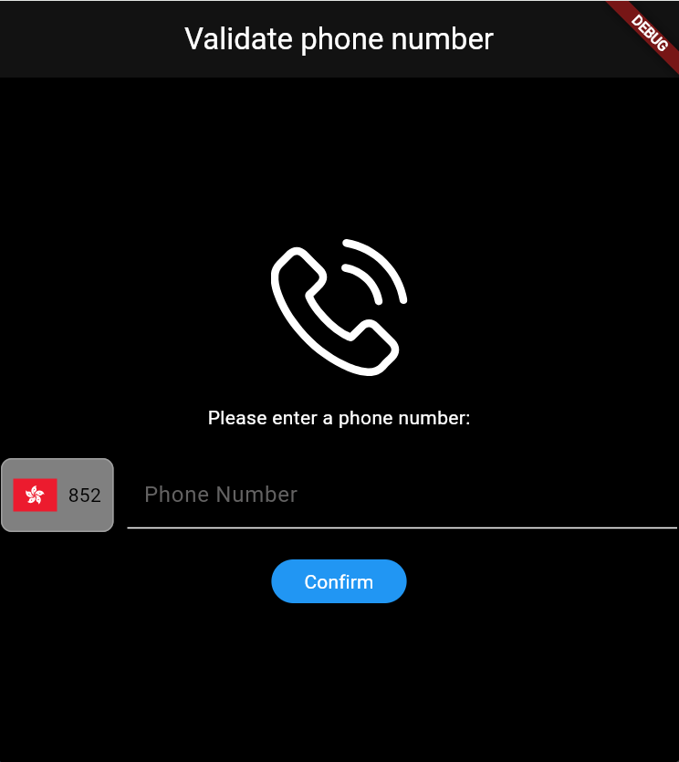
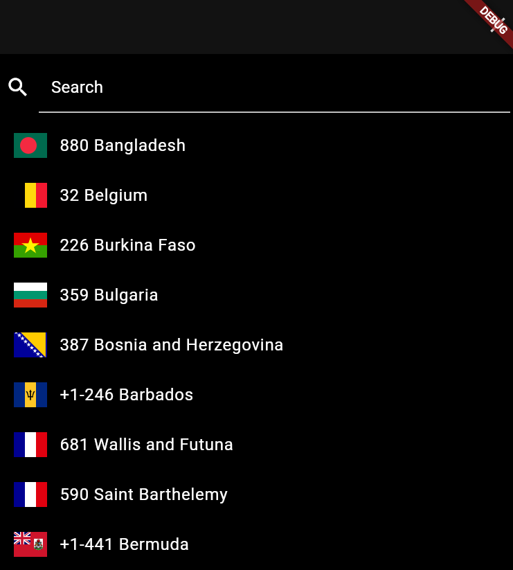
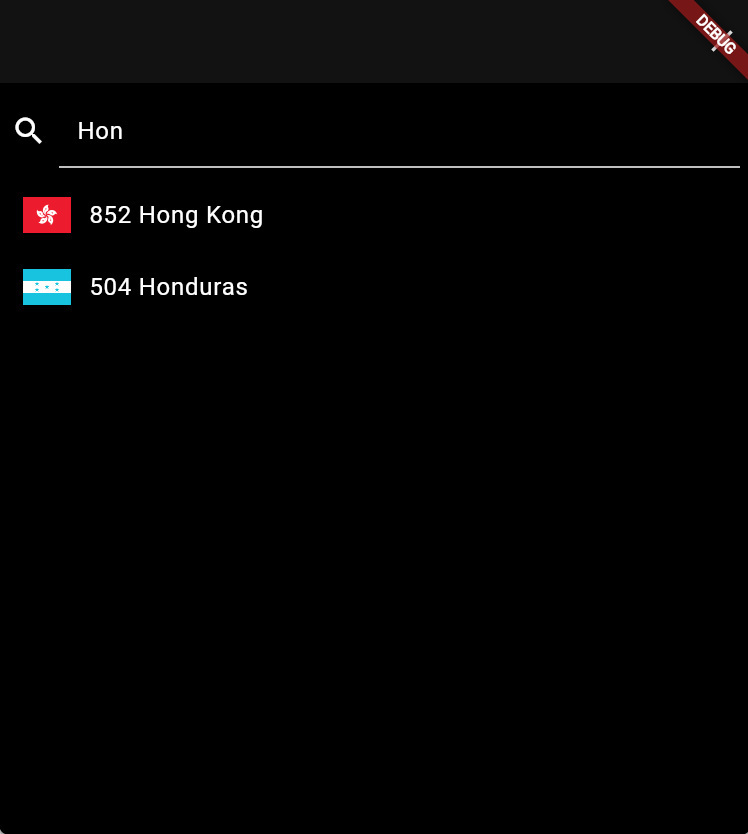
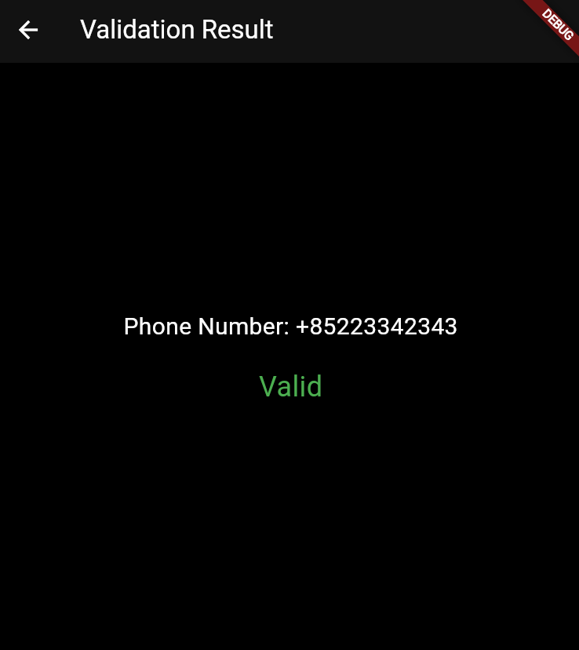

# phone_number_validation

A Flutter project.

## Getting Started

This project aims to search the country code and verify the input phone number.

###Preparation for flutter in Vscode
- Install extension for Flutter;
- Press `Ctrl+Shift+P` and enter `Flutter: New Project`;
- Choose `File > Open Folder`, enter the new project;
- Type `flutter run` in the termial;

###Install proxy server to avoid CORS
- Install http-proxy-middleware
Create a `proxy.js` file in the root directory, enter `npm install http-proxy-middleware` in the terminal;

- Configuration
No need to go through this step, already done;

- Run the proxy server
Enter `node proxy.js` in the terminal;

###Register for Twilio and get your accountSid and authToken
Fill in the null char in validation_bloc.dart file
`final accountSid = ''; // Twilio Account SID
 final authToken = ''; // Twilio Auth Token`

###Run result

